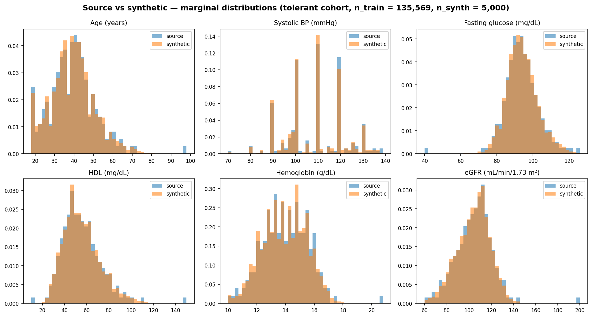
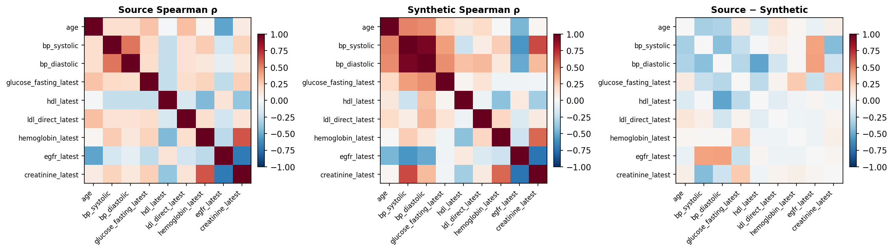
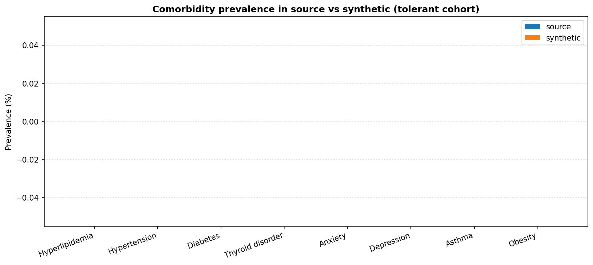

# 🩺 syntha

> **A [Synthea](https://github.com/synthetichealth/synthea)-inspired hybrid synthetic patient record generator**
> — learns the joint distribution of real anonymized Turkish-cohort EHR episodes with a Gaussian copula, then layers Synthea-style clinical pathways on top to emit fully-coded FHIR R4 bundles in Turkish.

[](https://github.com/ArioMoniri/syntha/actions/workflows/ci.yml)
[](https://github.com/ArioMoniri/syntha/actions/workflows/cross-platform.yml)
[](https://github.com/ArioMoniri/syntha/actions/workflows/release.yml)
[](https://github.com/ArioMoniri/syntha/actions/workflows/verify-install-buttons.yml)
[](https://github.com/ArioMoniri/syntha/releases/latest)
[](https://github.com/ArioMoniri/syntha/releases)
[](LICENSE)
[](https://www.python.org/downloads/)
[](https://hl7.org/fhir/R4/)
[](#-turkish-cohort--turkish-output)

---

## 🖥️ Desktop app — generate synthetic patients without code

<p align="center">
  <a href="https://github.com/ArioMoniri/syntha/releases/latest/download/syntha_aarch64.dmg"></a>
  &nbsp;
  <a href="https://github.com/ArioMoniri/syntha/releases/latest/download/syntha_x64-setup.exe"></a>
  &nbsp;
  <a href="https://github.com/ArioMoniri/syntha/releases/latest/download/syntha_amd64.AppImage"></a>
</p>

<p align="center">
  <sub>A Tauri 2 desktop app that bundles the trained Gaussian copula and samples synthetic patients <b>fully client-side</b> (no Python required). Pick cohort + n + seed + constraints, hit <b>Generate</b>, and download a CSV.</sub>
</p>

> 📦 Installers are produced by the [release workflow](.github/workflows/release.yml) on every `v*` tag push and live at stable filenames (`syntha_aarch64.dmg`, `syntha_x64-setup.exe`, `syntha_amd64.AppImage`). The buttons above all use `releases/latest/download/…` so they **track the latest release automatically** — no manual link maintenance per version. A daily [Install-buttons verification workflow](.github/workflows/verify-install-buttons.yml) HEAD-checks each URL and opens an issue if any 404s. Source for the app lives in [`app/`](app/).

> 🛡️ **macOS sees `"syntha.app" is damaged`?** That's Gatekeeper's misleading error for unsigned apps. Until the signing pipeline ships ([app/README.md → signing setup](app/README.md#macos-code-signing--notarization)), strip the quarantine flag manually:
> ```bash
> xattr -dr com.apple.quarantine /Applications/syntha.app
> ```

---

## 📑 Table of contents

- [🔍 Why syntha?](#-why-syntha)
- [🎯 What it produces](#-what-it-produces)
- [⚠️ The catch (what it is *not*)](#%EF%B8%8F-the-catch-what-it-is-not)
- [🇹🇷 Turkish cohort + Turkish output](#-turkish-cohort--turkish-output)
- [🧪 Use cases](#-use-cases)
- [🚀 Quick start](#-quick-start)
- [📊 Distribution fidelity](#-distribution-fidelity)
- [📦 Example output](#-example-output-embedded)
- [🌐 FHIR endpoints](#-fhir-endpoints)
- [🧱 Architecture](#-architecture)
- [🧬 Synthea-style clinical modules](#-synthea-style-clinical-modules)
- [🛠️ CLI reference](#%EF%B8%8F-cli-reference)
- [🗺️ Roadmap](#%EF%B8%8F-roadmap)
- [🤝 Contributing + clinician curation](#-contributing--clinician-curation-welcome)
- [📄 License + citation](#-license--citation)

---

## 🔍 Why syntha?

Synthea is the gold standard for synthetic FHIR patients, but it is **rules-only** and tuned to US population priors. CTGAN-style purely-generative models capture data faithfully but emit physiologically impossible tuples and have no clinical-pathway awareness. **syntha gives you both:**

|  | Synthea (rules-only) | CTGAN / copula-only | **syntha (hybrid)** |
|---|---|---|---|
| Matches *this cohort's* lab distributions | ❌ generic US priors | ✅ | ✅ |
| Coherent prescriptions per condition | ✅ | ❌ | ✅ |
| Physiologically valid (BP, eGFR…) | ✅ | ⚠️ sometimes | ✅ |
| LOINC + SNOMED + ICD-10 + RxNorm-coded FHIR | ✅ | ❌ | ✅ |
| Longitudinal trajectories | ✅ state machines | ❌ | ✅ drift + sticky flags |
| Turkish locale (names, addresses, displays) | ❌ | ❌ | ✅ |

## 🎯 What it produces

For each synthetic patient, syntha emits a FHIR R4 *transaction* `Bundle` containing:

- 👤 **Patient** — Turkish HumanName + Address + `tr` language code, derived birthDate
- 🧪 **Observation** × ~12 — LOINC-coded labs and vitals (glucose, lipid panel, CBC, LFTs, eGFR, BP, …)
- 🩺 **Condition** × N — every active comorbidity flag, **dual-coded SNOMED CT + ICD-10**, with English/Turkish display text
- 🏥 **Encounter** × M — one per active condition, driven by the relevant clinical module
- 💊 **MedicationRequest** × P — RxNorm-coded, dosage included
- 🔬 **Procedure** × Q — e.g. HbA1c, lipid panel, ECG, spirometry
- 📋 **CarePlan** × R — disease-specific lifestyle / monitoring plans

Plus a flat CSV that matches the **input schema** for drop-in use as training data.

## ⚠️ The catch (what it is *not*)

- 🚫 **Not** a substitute for real PHI when validity hinges on rare events — the copula reproduces the *bulk* of the joint distribution, not the long tails.
- 🚫 **Not** privacy-proof. Gaussian copulas are not differentially private; if the source has fewer than ~50 patients with a rare combination, syntha may reproduce that combination too closely. **Do not use** when the source is a small sensitive cohort without adding a DP mechanism.
- 🚫 **No disease *progression* simulator** yet — the copula gives a cross-sectional snapshot; longitudinal mode adds plausible drift but is not a Synthea-PADM state machine. (See [v0.8 in the roadmap](ROADMAP.md).)
- 🚫 The source CSVs are **anonymized retrospective Turkish-cohort episodes of healthy patients** — synthetic disease prevalence is *lower* than Turkish national averages (TÜİK). If you need a population-representative Turkish cohort, calibrate per the [`v0.6` roadmap items](ROADMAP.md).
- ⚠️ **Continuous↔binary correlations are attenuated ~50% in magnitude** (signs are correct since v0.3.2). Pure Spearman rank correlation on tied binary columns is biased toward zero; the proper fix is the polyserial/tetrachoric correlation, queued as [v0.4 in the roadmap](ROADMAP.md). For most downstream uses (training risk models, healthy-control comparisons) this is acceptable; if you need exact lab↔disease correlations, wait for v0.4 or contribute the fix.

## 🇹🇷 Turkish cohort + Turkish output

The training data comes from `pristine_strict_episodes.csv` and `pristine_tolerant_episodes.csv` — anonymized retrospective EHR episodes from a Turkish patient cohort selected to represent *clinically pristine* (i.e. healthy / minimally medicated) adults. Source CSVs are **never** committed to this repo (gitignored).

Synthetic output is **Turkish-localized**:

- Patient names sampled from common Turkish given-name and family-name distributions (`src/syntha/locale/turkish.py`).
- Addresses use real Turkish cities weighted by approximate population, with ISO 3166-2:TR province codes.
- Every Condition emits both an English SNOMED display and a clinical-Turkish translation in `Condition.code.text`.
- Patient.communication is set to `tr`.

All clinical terminology used (LOINC, SNOMED CT, ICD-10, RxNorm) comes from **open international standards** — no licensed terminology content is reproduced or embedded.

## 🧪 Use cases

| Where to use it | Why |
|---|---|
| 🤖 **Training ML risk models** without exposing real PHI | The copula preserves joint distributions, so a model trained on synthetic data transfers reasonably to real test sets (TSTR benchmark in v0.9). |
| 🧬 **Bioinformatics healthy-control cohorts** | The source is *pristine healthy* episodes — use the synthetic patients as a normal-baseline group to compare against your disease cohort. |
| 🛠️ **EHR pipeline / ETL integration testing** | Realistic-but-fake FHIR R4 bundles with valid LOINC/SNOMED/ICD-10/RxNorm codes are ideal for testing FHIR consumers, mapping pipelines, and OMOP/i2b2 ETLs without DPA paperwork. |
| 📚 **Teaching / coursework** | Drop-in dataset for biostatistics, epidemiology, and clinical-informatics teaching without IRB. |
| 🔬 **Data augmentation** | Boost rare-event coverage by oversampling synthetic patients with specific comorbidity combinations (conditional sampling lands in v0.7). |

## 🚀 Quick start

```bash
# 1. Install
git clone https://github.com/ArioMoniri/syntha.git
cd syntha
pip install -e .

# 2. (Optional) Ingest your source CSVs — files in data/raw/ are gitignored
bash scripts/ingest_csvs.sh

# 3. Generate 1000 synthetic episodes + FHIR bundles + model card + validation report
syntha generate \
  --input data/raw/pristine_tolerant_episodes.csv \
  --output output/tolerant \
  --n 1000 --cohort tolerant

# 4. Longitudinal — 500 baseline patients × ~4 encounters over 3 years
syntha generate \
  --input data/raw/pristine_tolerant_episodes.csv \
  --output output/tolerant_long \
  --n 2000 --cohort tolerant \
  --longitudinal --encounters-per-patient 4 --years-of-history 3

# 5. Validate any synthetic CSV against its source
syntha validate \
  --source data/raw/pristine_tolerant_episodes.csv \
  --synthetic output/tolerant/synthetic_tolerant_episodes.csv \
  --output output/tolerant/validation.json
```

## 📊 Distribution fidelity

A 100-episode sample of `tolerant` cohort vs the full 135 569-row source:

### Marginal distributions



### Spearman correlation structure



### Disease prevalence



### Numbers (from `examples/sample_output/sample_validation_report.json`)

| Metric | Value |
|---|---|
| n (source / synthetic) | 135 569 / 100 |
| **Max Kolmogorov–Smirnov** across continuous columns | **0.14** |
| Mean KS | 0.07 |
| **Max binary-prevalence error** | **0.025** (`has_rx_data`) |
| Disease-prevalence error (HTN / DM / hyperlipidemia) | 0.015 / 0.004 / 0.010 |
| Spearman correlation-matrix Frobenius diff | 2.94 |

> 📝 The KS statistic is well below the typical 0.20 "noticeable difference" threshold for every column; binary marginals (gender, disease prevalence) match to within ~1 percentage point.

## 📦 Example output (embedded)

A pretty-printed sample FHIR Bundle, a 100-episode synthetic CSV, the model card, and the validation report all live under [`examples/sample_output/`](examples/sample_output/) and are tracked in git.

| File | Click to view (GitHub built-in viewer) | What's inside |
|---|---|---|
| 🧾 **Full FHIR Bundle (pretty)** | [`sample_bundle_pretty.json`](examples/sample_output/sample_bundle_pretty.json) | One transaction Bundle: Patient + Observations + Conditions + Encounter + MedicationRequests + Procedure + CarePlan |
| 📡 **100 bundles, NDJSON** | [`sample_bundles.ndjson`](examples/sample_output/sample_bundles.ndjson) | Bulk-FHIR-style export, one transaction Bundle per line |
| 📊 **Flat CSV** | [`sample_episodes.csv`](examples/sample_output/sample_episodes.csv) | 100 synthetic episodes matching input schema |
| 🗒️ **Model card** | [`sample_model_card.json`](examples/sample_output/sample_model_card.json) | source sha256, n_train, marginals, top correlations |
| ✅ **Validation report** | [`sample_validation_report.json`](examples/sample_output/sample_validation_report.json) | KS / Wasserstein / correlation-Frobenius per column |

> 💡 **Embedded viewer.** GitHub renders the linked JSON files with syntax highlighting and a collapsible outline (click the `{}` icon top-right of the file view). For full **FHIR-aware** validation and tree-view rendering, drag the file onto [simplifier.net](https://simplifier.net/) or paste it into the [official HL7 Clinical FHIR Renderer](https://clinical-fhir.github.io/Renderer/).

<details>
<summary>👁️ <b>Inline preview — first synthetic patient (click to expand)</b></summary>

```json
{
  "resourceType": "Bundle",
  "type": "transaction",
  "timestamp": "2017-05-27T21:49:42Z",
  "entry": [
    {
      "resource": {
        "resourceType": "Patient",
        "id": "20f13c43-d17b-443b-b7a7-69ccc40631c6",
        "gender": "male",
        "name": [{"use": "official", "family": "Avcı", "given": ["Furkan"]}],
        "address": [{
          "use": "home", "type": "physical",
          "city": "İstanbul", "state": "TR-34", "country": "TR"
        }],
        "communication": [{
          "language": {"coding": [{"system": "urn:ietf:bcp:47", "code": "tr", "display": "Turkish"}]},
          "preferred": true
        }],
        "birthDate": "1975-…"
      }
    },
    {
      "resource": {
        "resourceType": "Observation",
        "code": {
          "coding": [{"system": "http://loinc.org", "code": "8480-6",
                       "display": "Systolic blood pressure"}]
        },
        "valueQuantity": {"value": 118.72, "unit": "mm[Hg]"}
      }
    },
    {
      "resource": {
        "resourceType": "Condition",
        "code": {
          "coding": [
            {"system": "http://snomed.info/sct", "code": "414545008",
             "display": "Ischemic heart disease (disorder)"},
            {"system": "http://hl7.org/fhir/sid/icd-10", "code": "I25.9",
             "display": "Chronic ischaemic heart disease, unspecified"}
          ],
          "text": "Ischemic heart disease (disorder) / İskemik kalp hastalığı"
        }
      }
    },
    {
      "resource": {
        "resourceType": "MedicationRequest",
        "medicationCodeableConcept": {
          "coding": [{
            "system": "http://www.nlm.nih.gov/research/umls/rxnorm",
            "code": "243670", "display": "Aspirin 81 MG Oral Tablet"
          }]
        },
        "dosageInstruction": [{"text": "81 mg daily"}]
      }
    }
  ]
}
```

</details>

<details>
<summary>👁️ <b>Inline preview — first 5 rows of the CSV</b></summary>

| RF_EPISODE2 | HASTA_ID | episode_date | gender | age | bp_sys | bp_dia | hdl | ldl | hgb | egfr | Hipertansiyon | DM_Tum |
|---|---|---|---|---|---|---|---|---|---|---|---|---|
| 92893619 | SYN_7D70431D | 2017-05-27 | M | 42 | 118.7 | 63.0 | 95.0 | 58.0 | 12.9 | 105.7 | 0 | 0 |
| … | … | … | … | … | … | … | … | … | … | … | … | … |

Full file: [`examples/sample_output/sample_episodes.csv`](examples/sample_output/sample_episodes.csv) (100 rows × 73 cols).

</details>

<details>
<summary>👁️ <b>Inline preview — validation report summary</b></summary>

```json
{
  "n_source": 135569,
  "n_synthetic": 100,
  "ks_max": 0.14,
  "ks_mean": 0.07,
  "binary_max_abs_error": 0.025,
  "correlation_frobenius": 2.94
}
```

</details>

## 🌐 FHIR endpoints

syntha emits canonical FHIR R4 resources, so every emitted resource type maps to its standard REST endpoint:

| Resource type | GET (read) | GET (search) | Create (POST to base) |
|---|---|---|---|
| 👤 Patient | `GET /Patient/{id}` | `GET /Patient` | as part of transaction `Bundle` |
| 🧪 Observation | `GET /Observation/{id}` | `GET /Observation?subject={ref}` | ↑ |
| 🩺 Condition | `GET /Condition/{id}` | `GET /Condition?patient={id}` | ↑ |
| 🏥 Encounter | `GET /Encounter/{id}` | `GET /Encounter?patient={id}` | ↑ |
| 💊 MedicationRequest | `GET /MedicationRequest/{id}` | `GET /MedicationRequest?patient={id}` | ↑ |
| 🔬 Procedure | `GET /Procedure/{id}` | `GET /Procedure?patient={id}` | ↑ |
| 📋 CarePlan | `GET /CarePlan/{id}` | `GET /CarePlan?patient={id}` | ↑ |
| 📦 Bundle | `GET /Bundle/{id}` | — | `POST /` (transaction) |

### Spin up a demo FHIR server locally

```bash
syntha serve --bundles examples/sample_output/sample_bundles.ndjson --port 8080
```

Then:

```bash
curl http://127.0.0.1:8080/metadata           # CapabilityStatement
curl http://127.0.0.1:8080/Patient            # searchset Bundle (all Patients)
curl http://127.0.0.1:8080/Patient/{id}       # single Patient
curl http://127.0.0.1:8080/Observation        # all Observations
curl http://127.0.0.1:8080/\$export           # FHIR Bulk Data export (NDJSON)
```

This is a **read-only demo server** (stdlib `http.server`, no dependencies). For a production-grade FHIR server, POST the bundles to a HAPI / Microsoft FHIR / Google Healthcare API instance — see below.

### POST the bundles to any FHIR R4 server

`scripts/post_to_fhir.sh` POSTs every transaction Bundle in an NDJSON file to a configurable FHIR endpoint (default: the public [HAPI test server](https://hapi.fhir.org/baseR4)):

```bash
# To the public HAPI playground:
bash scripts/post_to_fhir.sh examples/sample_output/sample_bundles.ndjson

# To your own server:
FHIR_BASE=http://localhost:8080/fhir bash scripts/post_to_fhir.sh
```

Once uploaded, you can browse the resources in any FHIR UI — e.g. [HAPI's built-in browser](https://hapi.fhir.org/) or the [Open Patient Browser](https://patient-browser.smarthealthit.org/).

## 🧱 Architecture

```
┌──────────────┐    ┌──────────────────┐    ┌──────────────────────┐
│  Source CSV  │──▶│  Gaussian copula  │──▶│ Physiologic filter   │
│ (Turkish     │    │ (Spearman → ρ;   │    │ (BP, Friedewald,     │
│  pristine)   │    │ nearest-PSD)     │    │  eGFR/creatinine)    │
└──────────────┘    └──────────────────┘    └─────────┬────────────┘
                                                       │
                                  ┌────────────────────┴────────────────────┐
                                  │                                         │
                                  ▼                                         ▼
                       ┌──────────────────┐                  ┌──────────────────────────┐
                       │ Longitudinal     │   (optional)     │  Direct single-episode   │
                       │ expansion        │ ───────────────▶│  CSV + FHIR R4 export     │
                       │ (drift, Poisson) │                  │  with Synthea-style       │
                       └─────────┬────────┘                  │  module activation        │
                                 │                            └──────────────────────────┘
                                 ▼
                          (same FHIR export)
```

Read [docs/ARCHITECTURE.md](docs/ARCHITECTURE.md) for the math (Spearman→Gaussian transform, nearest-PSD projection, constraint rules).

## 🧬 Synthea-style clinical modules

Nine modules ship out of the box (`src/syntha/modules/`); each fires on its corresponding source-CSV comorbidity flag:

| Module | Flag(s) | Emits |
|---|---|---|
| 🫀 Hypertension | `Hipertansiyon` | Encounter, 1–2 antihypertensives (stage 2 → dual), CarePlan |
| 🍬 Diabetes | `DM_Tum`, `DM_Komplikasyonlu` | Encounter, HbA1c, metformin (+ insulin if severe), CarePlan |
| 🧀 Hyperlipidemia | `Hiperlipidemi` | Encounter, lipid panel, statin (high-intensity if LDL ≥ 190) |
| 🦋 Thyroid | `Tiroid` | Encounter, TSH, levothyroxine |
| 😔 Depression | `Depresyon` | Psych encounter, sertraline, CBT CarePlan |
| 😰 Anxiety | `Anksiyete` | Psych encounter, escitalopram (or buspirone if already on SSRI) |
| ❤️ IHD | `Iskemik_Kalp` | Cardiology encounter, ECG, aspirin + β-blocker + statin |
| 🌬️ Asthma | `Astim` | Resp encounter, spirometry, SABA + ICS |
| 🚭 COPD | `COPD` | Resp encounter, spirometry, LABA + SABA |

See [docs/MODULES.md](docs/MODULES.md) for the authoring guide. Clinician contributions for **TR-specific drug choices** are highly welcome — see [CONTRIBUTING.md](CONTRIBUTING.md).

## 🛠️ CLI reference

| Command | Description |
|---|---|
| `syntha generate` | End-to-end: train copula + sample + modules + CSV/FHIR + model card + validation report |
| `syntha fit` | Fit and persist a copula in a registry without sampling |
| `syntha sample` | Raw sampling from a registered model |
| `syntha fhir` | Convert an existing synthetic CSV to FHIR bundles |
| `syntha validate` | KS / Wasserstein / correlation diff between source and synthetic |
| `syntha serve` | Boot a read-only FHIR R4 demo server from a bundles NDJSON file |
| `syntha export-model` | Export a registered copula to a compact JSON the desktop app consumes |
| `syntha list-models` | List models in a registry |
| `syntha show-card` | Print a model card |

Run `syntha <cmd> --help` for full option lists.

## 🗺️ Roadmap

The full phased roadmap (v0.1 → v1.0) lives in [ROADMAP.md](ROADMAP.md). Highlights:

- **v0.6 — clinician curation** 🟣 — needs Dr. Moniri (or a collaborator)
- **v0.7 — optional CTGAN/TVAE backend** ⬜
- **v0.8 — true Synthea PADM-style state machines** ⬜
- **v0.9 — TSTR benchmark** ⬜
- **v1.0 — PyPI + paper** ⬜

## 🤝 Contributing + clinician curation welcome

There are **three ways** to feed clinical guidance into syntha — pick whichever is least friction for you:

### 1. 🚀 Just tell me (lowest friction)

Reply in any open conversation with Claude (the agent that maintains this repo) saying e.g.

> *"In Türkiye, perindopril 5 mg is the typical first-line ACEi for uncomplicated hypertension per TKD 2023 — switch the default in the hypertension module."*

…and I'll edit the relevant file, push, and re-run CI. No GitHub UI needed.

### 2. 📝 GitHub issue (recommended for asynchronous tracking)

Open an issue using the **🧑‍⚕️ Clinical curation** template — one click:

👉 **[Open a Clinical curation issue](https://github.com/ArioMoniri/syntha/issues/new?template=clinical_curation.md&labels=clinical-curation&title=%5Bclinical-curation%5D%20)** 👈

The template pre-lists the files most likely to need changes:

| If you want to change… | Edit this file |
|---|---|
| Which drug a module prescribes | `src/syntha/modules/<condition>.py` |
| The RxNorm code or dose text | `src/syntha/fhir/rxnorm.py` |
| The SNOMED / ICD-10 code for a Condition | `src/syntha/fhir/codes.py` |
| Turkish display strings | `src/syntha/locale/turkish.py` |
| Prevalence calibration / disease-progression rules | `src/syntha/longitudinal.py` |

### 3. 🔧 Pull request

```bash
git clone https://github.com/ArioMoniri/syntha
cd syntha
pip install -e ".[dev]"
# … edit files …
pytest -q
git checkout -b clinical/<short-topic>
git commit -am "clinical: <what you changed and why>"
git push -u origin clinical/<short-topic>
gh pr create   # or open via the GitHub UI
```

### What's currently flagged 🟣 (waiting for clinician input)

Per [ROADMAP.md → v0.6](ROADMAP.md):

- 🟣 **TR-specific first-line drug calibration** — current defaults are international (lisinopril/amlodipine for HTN, metformin for DM, atorvastatin for hyperlipidemia). Turkish primary-care reality may differ (e.g. perindopril, nebivolol).
- 🟣 **New modules**: CKD staging (eGFR-driven), MAFLD (ALT/AST + obesity), anemia (Hb-driven), B12 deficiency (vit B12 column directly available).
- 🟣 **Prevalence calibration to TÜİK** — synthetic disease rates currently mirror the *pristine-healthy* source cohort. To use syntha as a Turkish-population baseline rather than a healthy baseline, the marginals should be calibrated to TÜİK figures.
- 🟣 **Turkish display string review** — confirm clinical-Turkish preferred terms match `Türk Tabipleri Birliği` / TR-specific usage rather than literal translations.
- 🟣 **ICD-10 specificity** — the current mapping uses unspecified (".9") forms; specifying further (`E11.65`, `I50.32`, etc.) when the source flag carries the information would improve downstream realism.

Full developer guide: [CONTRIBUTING.md](CONTRIBUTING.md). All PRs must pass the CI matrix (Py 3.10 → 3.13) before merge.

## 📄 License + citation

Apache 2.0 © 2026 **Ariorad Moniri** — see [LICENSE](LICENSE).

If you use syntha in academic work, please cite:

```
Moniri, A. (2026). syntha: hybrid synthetic patient record generator
trained on Turkish pristine-healthy EHR cohorts.
https://github.com/ArioMoniri/syntha
```

---

### Acknowledgements

- 🩺 [Synthea](https://github.com/synthetichealth/synthea) — the inspiration for the clinical-module layer and FHIR output format.
- 🌐 Open clinical terminologies: [LOINC](https://loinc.org/), [SNOMED CT](https://www.snomed.org/), [ICD-10](https://icd.who.int/browse10/), [RxNorm](https://www.nlm.nih.gov/research/umls/rxnorm/).
- 📊 The anonymized Turkish-cohort EHR data used to train the copula (de-identified by the upstream data steward; never redistributed by this repo).
